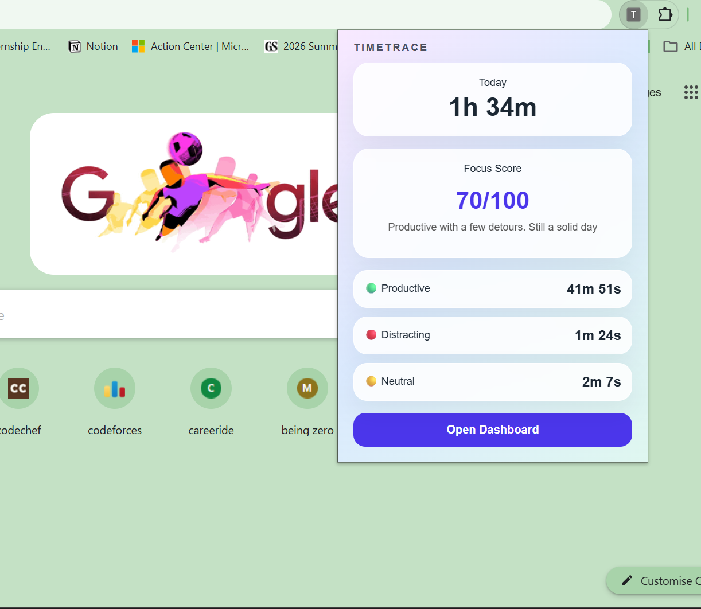
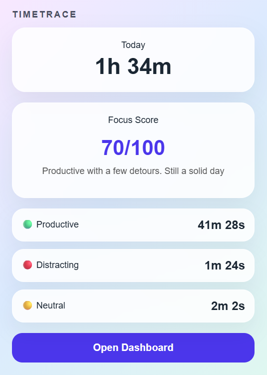
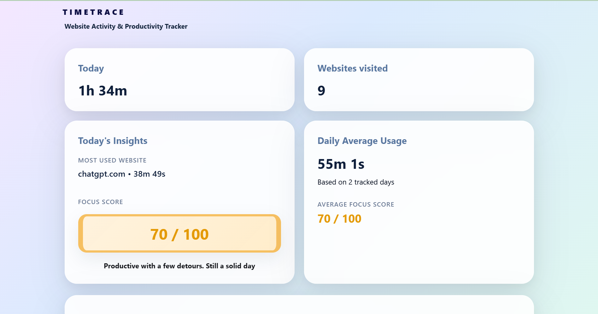
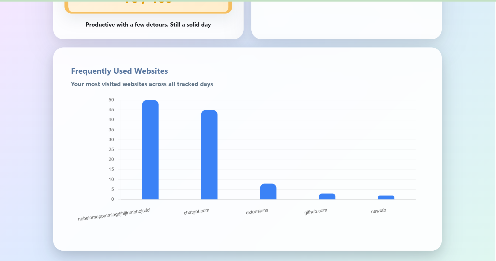
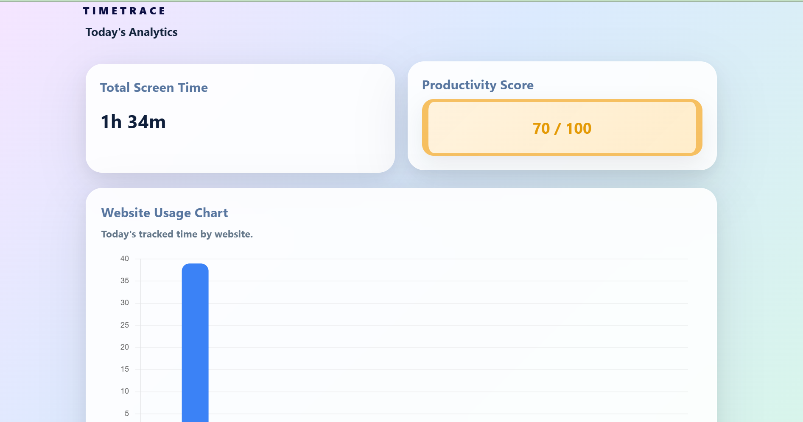
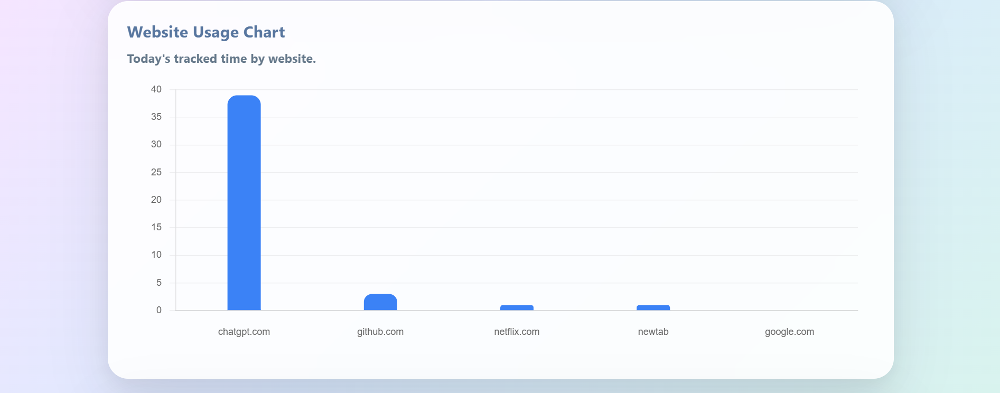
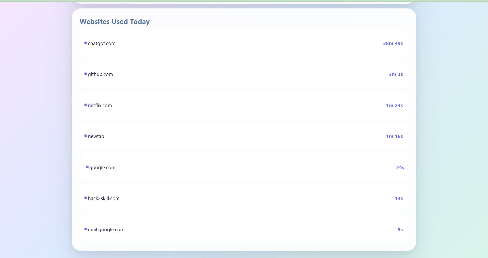
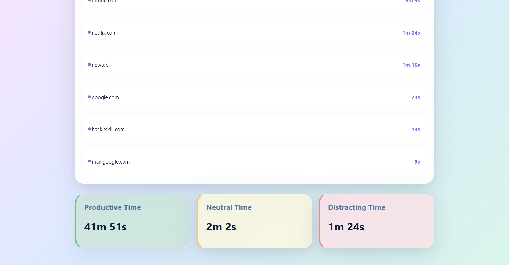

# TimeTrace

A Chrome extension that helps users monitor screen time, analyze website usage patterns, and evaluate productivity through real-time tracking and interactive analytics dashboards.

---

## Overview

TimeTrace was developed to help users better understand their browsing habits and improve productivity. The extension tracks website usage in real time, categorizes browsing activity into productive, neutral, and distracting segments, and presents meaningful insights through a clean and intuitive interface.

Users can view their daily screen time, productivity score, website usage analytics, and long-term browsing trends directly within the browser.

---

## Features

* Real-time website usage tracking
* Daily screen time monitoring
* Productivity score that evaluates browsing behavior based on time spent on productive, neutral, and distracting websites
* Categorizes websites into Productive, Neutral, and Distracting groups
* Tracks time spent in each productivity category
* Today's Analytics page with detailed insights
* Frequently Used Websites visualization
* Daily average usage statistics and productivity score tracking

---

## Productivity Score

TimeTrace calculates a Productivity Score (0–100) based on the user's browsing activity.

Websites are categorized into:

* **Productive** – Educational platforms, coding websites, documentation, learning resources, and work-related websites.
* **Neutral** – Search engines, utility websites, and general browsing.
* **Distracting** – Entertainment, social media, gaming, and other non-productive websites.

The score is determined by comparing the amount of time spent across these categories. Higher time spent on productive websites results in a higher score, while excessive time on distracting websites lowers the score. 
Productivity score is alternately called as focus score.

This provides users with a quick overview of how effectively they are utilizing their screen time.

---

## Tech Stack

| Component         | Technologies                    |
| ----------------- | ------------------------------- |
| Frontend          | HTML, CSS, JavaScript           |
| Charts            | Chart.js                        |
| Browser APIs      | Chrome Extensions API           |
| Storage           | Chrome Storage API              |
| Development Tools | VS Code, Chrome Developer Tools |

---

## Installation

### 1. Clone the Repository

```bash
https://github.com/inshirah1243/TimeTrace.git
cd TimeTrace
```

### 2. Open Chrome Extensions

Navigate to:

```text
chrome://extensions
```

### 3. Enable Developer Mode

Turn on **Developer Mode** in the top-right corner.

### 4. Load the Extension

Click **Load unpacked** and select the TimeTrace project folder.

---

## Project Structure

```text
TimeTrace/
|
├── manifest.json
|── background.js
│
├── popup.html
├── popup.css
├── popup.js
│
├── dashboard.html
├── dashboard.css
├── dashboard.js
│
├── today.html
├── today.css
├── today.js
│
├── shared.js
│
├── libs/
    └── chart.umd.js

```

---

## Outputs
Below are sample outputs captured from during runtime.

### Extension Popup


---


---
### Dashboard



---


---

### Today Page



---


---


---


---

## Future Improvements

1. Weekly and monthly productivity reports
2. Export analytics as CSV or PDF
3. Custom website categorization
4. Goal setting and productivity targets
5. Dark mode support

---

## Author

- Inshirah Ibtihaz – [GitHub](https://github.com/inshirah1243)
---
